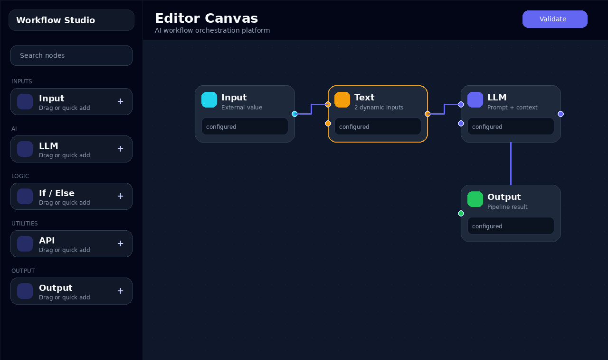
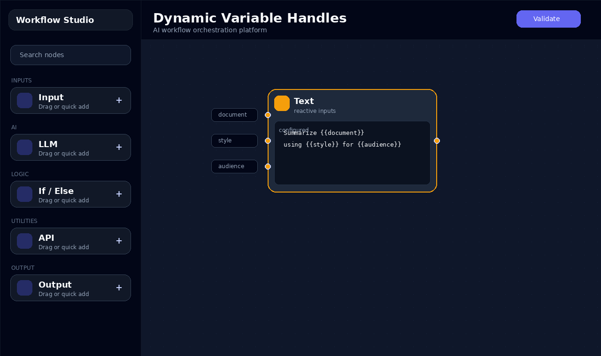
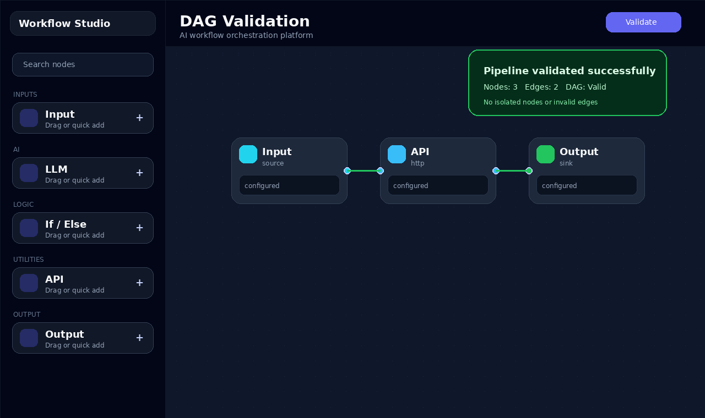
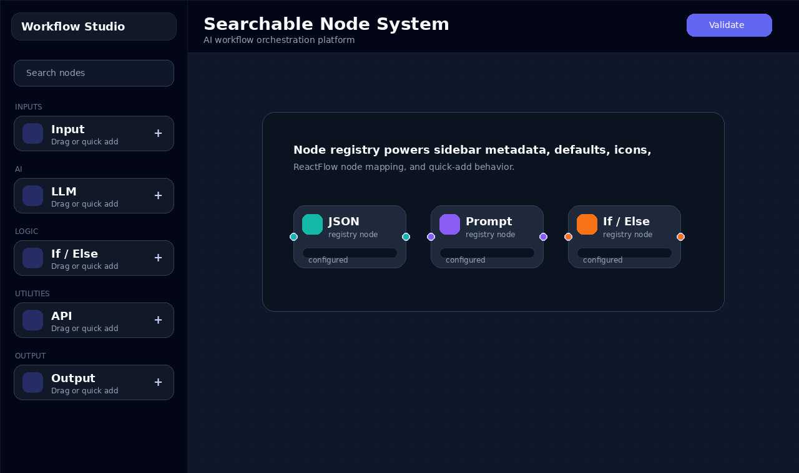

# Workflow Studio

AI Workflow Orchestration Platform for designing, connecting, validating, importing, and exporting graph-based automation pipelines.

[](https://react.dev/)
[](https://reactflow.dev/)
[](https://fastapi.tiangolo.com/)
[](https://workflow-studio-ai-pipeline-builder.vercel.app/)

Workflow Studio is built as a product-quality workflow editor inspired by LangFlow, n8n, Linear, Vercel tooling, and modern AI operations platforms. It combines a ReactFlow graph workspace, a reusable node engine, variable-aware prompt nodes, local workflow persistence, and a FastAPI validation service that understands graph structure.

Live app:

```text
https://workflow-studio-ai-pipeline-builder.vercel.app/
```

Repository:

```text
https://github.com/Xyberpunk/workflow-studio-ai-pipeline-builder
```

## Feature Highlights

- Dynamic node system with a shared `BaseNode` rendering engine
- Scalable node registry for plug-and-play node types
- Variable-aware Text and Prompt Template nodes using `{{variable}}` syntax
- Dynamic handle generation as variables are typed
- Auto-growing node dimensions using textarea measurement and `ResizeObserver`
- ReactFlow canvas with snap grid, animated edges, edge labels, minimap, and custom zoom controls
- Searchable draggable node sidebar with categories
- Zustand workflow store with nodes, edges, selection, validation state, undo/redo, and localStorage persistence
- Workflow export/import as JSON
- Toast-based validation UX with success, warning, and failure states
- FastAPI graph validation engine using Kahn's topological sorting algorithm
- Validation metadata for isolated nodes, duplicate edges, invalid edges, disconnected graphs, and cycles
- Vercel-only fullstack deployment using Python Functions for the API

## Demo



The committed demo asset is a 60-second walkthrough storyboard covering the core interaction path.

Demo flow:

1. Open the workflow builder.
2. Add workflow nodes from the sidebar.
3. Type variables such as `{{document}}` and `{{style}}`.
4. Watch dynamic handles appear.
5. Connect the graph.
6. Validate the pipeline and inspect DAG feedback.

## Screenshots

| Workflow Canvas | Dynamic Variable Handles |
| --- | --- |
|  |  |

| DAG Validation Toast | Sidebar Node System |
| --- | --- |
|  |  |

## Product Architecture

```text
Frontend (React + ReactFlow)
        |
        v
Workflow Graph State
        |
        v
FastAPI Validation Engine
        |
        v
DAG Analysis
```

## Tech Stack

Frontend:

- React 18
- ReactFlow
- TailwindCSS
- Framer Motion
- Zustand
- react-hot-toast
- lucide-react

Backend:

- Python
- FastAPI
- Pydantic
- Kahn topological sort for DAG validation

Deployment:

- Vercel static frontend
- Vercel Python Function API

## Project Structure

```text
workflow-studio-ai-pipeline-builder/
|-- api/
|   `-- index.py
|-- backend/
|   |-- __init__.py
|   |-- main.py
|   `-- requirements.txt
|-- frontend/
|   |-- public/
|   |-- src/
|   |   |-- components/
|   |   |   |-- BaseNode.jsx
|   |   |   |-- CanvasControls.jsx
|   |   |   |-- Layout.jsx
|   |   |   |-- NodeCard.jsx
|   |   |   |-- NodeField.jsx
|   |   |   |-- NodeHandle.jsx
|   |   |   |-- NodeHeader.jsx
|   |   |   |-- NodeToolbar.jsx
|   |   |   |-- Sidebar.jsx
|   |   |   |-- SubmitButton.jsx
|   |   |   `-- Topbar.jsx
|   |   |-- hooks/
|   |   |   |-- useDynamicSize.js
|   |   |   |-- useNodeDimensions.js
|   |   |   |-- useNodeSelection.js
|   |   |   |-- useNodeStyles.js
|   |   |   |-- usePipelineValidation.js
|   |   |   `-- useVariableParser.js
|   |   |-- nodes/
|   |   |   |-- APINode.jsx
|   |   |   |-- ConditionalNode.jsx
|   |   |   |-- DelayNode.jsx
|   |   |   |-- FilterNode.jsx
|   |   |   |-- InputNode.jsx
|   |   |   |-- JSONNode.jsx
|   |   |   |-- LLMNode.jsx
|   |   |   |-- MathNode.jsx
|   |   |   |-- MergeNode.jsx
|   |   |   |-- OutputNode.jsx
|   |   |   |-- PromptTemplateNode.jsx
|   |   |   `-- TextNode.jsx
|   |   |-- pages/
|   |   |   `-- WorkflowStudio.jsx
|   |   |-- registry/
|   |   |   `-- nodeRegistry.js
|   |   |-- store/
|   |   |   `-- useWorkflowStore.js
|   |   |-- styles/
|   |   |   `-- globals.css
|   |   |-- utils/
|   |   |   |-- graphUtils.js
|   |   |   |-- nodeFactory.js
|   |   |   |-- parseVariables.js
|   |   |   |-- pipelineSerializer.js
|   |   |   `-- validationUtils.js
|   |   |-- App.js
|   |   |-- index.css
|   |   |-- index.js
|   |   `-- submit.js
|   |-- package.json
|   |-- postcss.config.js
|   `-- tailwind.config.js
|-- requirements.txt
|-- vercel.json
`-- README.md
```

## Node System

Nodes are registered in `frontend/src/registry/nodeRegistry.js`. The registry owns:

- node component mapping for ReactFlow
- sidebar metadata
- categories
- icons
- accent colors
- default data

Example definition:

```js
api: {
  type: "api",
  label: "API",
  description: "HTTP request",
  category: "Integrations",
  icon: "Globe",
  color: "sky",
  defaults: () => ({
    url: "https://api.example.com/data",
    method: "GET",
    headers: "{ }",
  }),
}
```

Every node renders through `BaseNode`, which supports:

- configurable title and subtitle
- configurable icon and color
- configurable input and output handles
- configurable fields
- toolbar actions
- validation/status labels
- dynamic dimensions
- reusable layout and selected states

## Key Engineering Decisions

- Reusable `BaseNode` abstraction: keeps node rendering consistent while letting each node declare only fields, handles, icon, color, and status.
- Node registry system: centralizes node metadata, ReactFlow type mapping, sidebar grouping, defaults, and future extensibility.
- Dynamic variable parsing: uses a strict JavaScript identifier regex so prompt handles are reactive without accepting invalid variable names.
- DAG validation with Kahn's Algorithm: gives deterministic cycle detection and enables validation metadata for warnings and errors.
- Zustand workflow store: keeps graph state, selection, validation, history, persistence, import, and export logic outside UI components.
- Same-origin Vercel API: deploys the React app and FastAPI validation engine under one domain without external backend hosting.

## Implemented Nodes

- Input: external source values
- Output: terminal pipeline result
- Text: variable-aware text block with dynamic handles
- LLM: model, temperature, and system prompt
- API: URL, method, headers, response output
- Math: operation selector, numeric inputs, computed preview
- Filter: boolean branching
- Delay: async wait simulation
- Merge: multiple inputs into one output
- JSON: JSON editor with inline validation
- Prompt Template: LLM prompt templating with variable interpolation
- Conditional: if/else branching

## Variable Parsing

Text and Prompt Template nodes detect valid variables with:

```js
/{{\s*([a-zA-Z_$][a-zA-Z0-9_$]*)\s*}}/g
```

Valid:

- `{{input}}`
- `{{document}}`
- `{{user_name}}`

Invalid:

- `{{123}}`
- `{{hello-world}}`

Each valid variable creates a live input handle on the left side of the node.

## Graph Validation API

### POST `/api/pipelines/parse`

Request:

```json
{
  "nodes": [{ "id": "input-1", "type": "input", "data": {} }],
  "edges": [{ "source": "input-1", "target": "text-1" }]
}
```

Response:

```json
{
  "num_nodes": 3,
  "num_edges": 2,
  "is_dag": true,
  "isolated_nodes": [],
  "validation_errors": [],
  "warnings": []
}
```

The backend validates:

- DAG correctness
- cycle detection
- invalid edges
- duplicate edges
- isolated nodes
- disconnected graph components

## Local Development

Start the backend:

```bash
cd backend
python3 -m venv .venv
source .venv/bin/activate
pip install -r requirements.txt
uvicorn main:app --reload --host 0.0.0.0 --port 8000
```

Start the frontend:

```bash
cd frontend
npm install
npm start
```

Local URLs:

```text
Frontend: http://localhost:3000
Backend:  http://localhost:8000
```

For local frontend-to-backend calls, create `frontend/.env`:

```text
REACT_APP_API_BASE_URL=http://localhost:8000
```

On Vercel, leave `REACT_APP_API_BASE_URL` unset so the app uses same-origin `/api` routes.

## Verification

Frontend build:

```bash
cd frontend
npm run build
```

Backend smoke test:

```bash
cd backend
source .venv/bin/activate
python - <<'PY'
from fastapi.testclient import TestClient
from main import app

client = TestClient(app)
payload = {
    "nodes": [{"id": "a"}, {"id": "b"}],
    "edges": [{"source": "a", "target": "b"}],
}
print(client.post("/api/pipelines/parse", json=payload).json())
PY
```

## Vercel Deployment

This repo is configured for a single Vercel project.

Settings:

```text
Framework Preset: Other
Root Directory: ./
Build Command: cd frontend && npm install && npm run build
Output Directory: frontend/build
Install Command: leave empty
Environment Variables: none required
```

Vercel files:

- `vercel.json`: frontend build and API rewrite configuration
- `api/index.py`: Python Function entrypoint
- `requirements.txt`: Python dependencies for Vercel

## GitHub Presentation

Recommended repository description:

```text
Modern AI workflow orchestration platform built with ReactFlow, FastAPI, dynamic node abstraction, and DAG validation.
```

Recommended social preview image:

```text
docs/assets/editor-view.png
```

The repository includes screenshots and an animated demo under `docs/assets/` for profile, portfolio, and README presentation.

## Media

Recommended portfolio captures:

- Editor view with the searchable node sidebar
- Text node creating dynamic handles from `{{document}}` and `{{style}}`
- Connected DAG pipeline with animated edges
- Validation toast showing node count, edge count, and DAG status
- Export/import workflow JSON interaction

## Future Improvements

- Workflow execution engine with typed runtime values
- Persistent cloud storage for saved workflows
- Collaborative editing and multiplayer cursors
- AI agent orchestration primitives
- Plugin marketplace for custom nodes and integrations
- Execution logs, retries, and observability timelines
- Credential vault for API and model provider secrets

## Notes

- Create React App is retained because the starter project used CRA.
- `react-scripts` may report inherited dependency advisories in `npm audit`; the production path would be a Vite migration.
- Backend execution on Vercel uses Python Functions, not a long-running `uvicorn` process.
